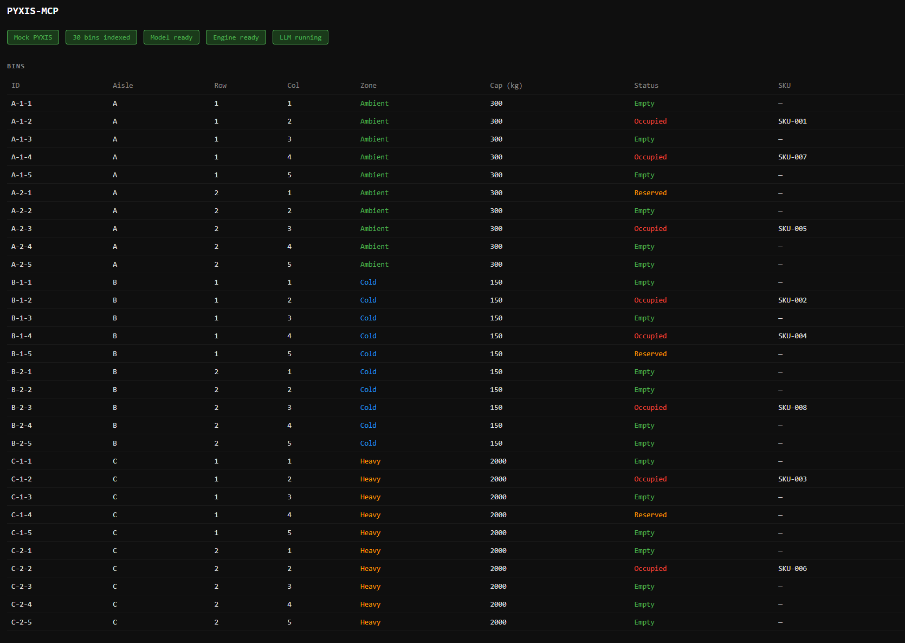
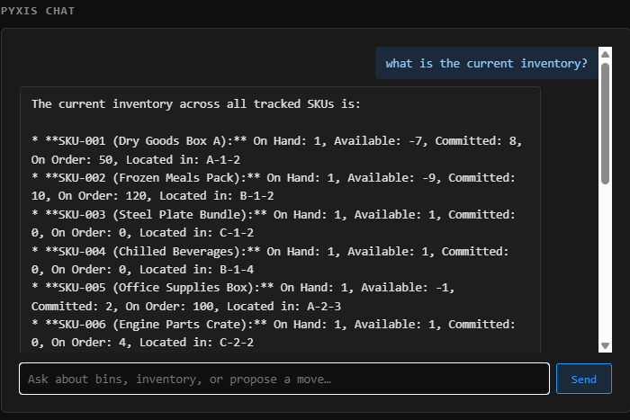

# PYXIS-MCP

PYXIS-MCP is a nano, demo prototype for warehouse Digital Twin & Chatbot, built in rust.

It bridges a local LLM (Gemma 4 via llama-server) with a warehouse management system through the Model Context Protocol (MCP). 
Data is sourced from both static data (like bins, SKU information) and dynamic data gathered through API (mock) calls (inventory, fast moving information) into the local LLM.
Operators interact via a browser dashboard; the LLM reasons over live inventory, bin locations, and safety constraints to propose validated bin moves.

Designed for air-gapped, edge deployment on NUC-class hardware (8 GB RAM minimum). No Docker, no cloud services, no external databases required.

---

<div align="center">
  <br>

  
  
</div>

## Tech Stack

| Layer | Component | Technology |
|-------|-----------|------------|
| LLM inference | llama-server (child process) | llama.cpp b8708+, Vulkan/CPU backend, GGUF format |
| LLM chat API | chatbot module | OpenAI-compatible `/v1/chat/completions`, tool-call loop |
| MCP server | mcp_server | rmcp 0.1, stdio transport, JSON-RPC 2.0; 6 tools |
| Vector search | vector_search | fastembed 5, BGE-Small-en-v1.5, 384-dim brute-force cosine; indexes bins + SKUs |
| Safety validation | safety_validation | 3-tier: semantic → relational → permissions |
| WMS client | pyxis_client | reqwest 0.12, async, JSON REST |
| Mock WMS | pyxis_mock | axum 0.8, in-memory RwLock, seeded data |
| Dashboard | gui | axum 0.8, embedded HTML const, SSE download progress |
| Async runtime | tokio | tokio 1, features = full |
| Serialisation | serde / serde_json | derive macros, PascalCase enum renaming |
| Error handling | anyhow / thiserror | anyhow for propagation, thiserror for typed errors |
| ZIP extraction | zip 2 | deflate feature only, in-memory extraction |

---

## Project Structure

```
PYXIS-MCP/
├── Cargo.toml                   # workspace manifest; edition = "2024"
├── Cargo.lock                   # locked dependency tree (committed)
├── .gitignore                   # excludes /target, /engines, /models, /.fastembed_cache, *.log
├── README.md                    # project documentation
│
├── src/
│   ├── main.rs                  # startup: env resolution, index build, engine spawn, tokio::select!
│   ├── models.rs                # domain types: Bin, Sku, User, StagedMove, Zone, Cert, enums
│   │
│   ├── pyxis_client.rs           # reqwest WMS client
│   │                            #   list_bins / get_bin
│   │                            #   list_skus / get_sku
│   │                            #   get_inventory (→ InventoryResponse)
│   │                            #   get_user
│   │                            #   stage_move / list_staged / update_move
│   │
│   ├── safety_validation.rs     # validate(bin, sku, user, pyxis) → 3-tier fail-fast
│   │                            #   tier 1 semantic  : weight + zone match
│   │                            #   tier 2 relational: live bin status == Empty
│   │                            #   tier 3 permission: user cert covers bin zone
│   │
│   ├── pyxis_mock/
│   │   └── mod.rs               # axum :3030; Arc<RwLock<MockDb>>
│   │                            #   30 bins (A/B/C × 2 rows × 5 cols)
│   │                            #   8 SKUs, 3 users, 4 clients, 5 pre-advice, 4 orders
│   │                            #   GET  /ords/wms/bins  /bins/:id
│   │                            #   GET  /ords/wms/skus  /skus/:id
│   │                            #   GET  /ords/wms/inventory/:sku[?client_id]
│   │                            #   GET  /ords/wms/clients  /clients/:id
│   │                            #   GET  /ords/wms/pre-advice  /pre-advice/:id
│   │                            #   GET  /ords/wms/orders  /orders/:id
│   │                            #   GET  /ords/wms/users/:id
│   │                            #   GET|POST /ords/wms/collections
│   │                            #   PUT  /ords/wms/collections/:id
│   │
│   ├── vector_search/
│   │   └── mod.rs               # VectorIndex (BGE-Small-en-v1.5, 384-dim, brute-force cosine)
│   │                            #   index_bins(bins)  → embed aisle/row/col/zone/cap text
│   │                            #   index_skus(skus)  → embed name/zone/weight text
│   │                            #   search(query, k)       → Vec<(score, bin_id)>
│   │                            #   search_skus(query, k)  → Vec<(score, sku_id)>
│   │
│   ├── mcp_server/
│   │   └── mod.rs               # rmcp ServerHandler; stdio transport; 6 tools
│   │                            #   list_skus        → pyxis_client::list_skus
│   │                            #   list_inventory   → list_skus + get_inventory for each SKU
│   │                            #   search_skus      → vector_search::search_skus
│   │                            #   search_bins      → vector_search::search
│   │                            #   check_inventory  → pyxis_client::get_inventory
│   │                            #   propose_move     → validate → pyxis_client::stage_move
│   │
│   ├── llm_engine/
│   │   └── mod.rs               # LlmEngine: spawns llama-server.exe as child process
│   │                            #   start()       → spawn + wait_ready (120s health poll)
│   │                            #   is_ready()    → engine_path + model_path exist
│   │                            #   is_running()  → child.try_wait() == Ok(None)
│   │                            #   stop() / Drop → child.kill()
│   │                            #   stdout+stderr → engines/llama-server.log
│   │
│   ├── chatbot/
│   │   └── mod.rs               # agentic ReAct loop over OpenAI-compat /v1/chat/completions
│   │                            #   max 8 tool-call turns per chat() invocation
│   │                            #   6 tools: list_skus / list_inventory / search_skus /
│   │                            #            search_bins / check_inventory / propose_move
│   │                            #   returns ChatResponse { reply, tool_calls: Vec<(name, result)> }
│   │
│   └── gui/
│       └── mod.rs               # axum :8080; all HTML/CSS/JS embedded as const strings
│                                #   GET  /                      → dashboard
│                                #   GET  /api/status            → { pyxis_mode, index_size, model_ready, engine_ready, engine_running }
│                                #   GET  /api/bins              → proxy pyxis_client::list_bins
│                                #   GET  /api/staged            → proxy pyxis_client::list_staged
│                                #   PUT  /api/staged/:id        → approve / reject move
│                                #   POST /api/model/download    → stream GGUF → models/gemma.gguf
│                                #   GET  /api/model/progress    → SSE download progress
│                                #   DELETE /api/model           → delete models/gemma.gguf
│                                #   POST /api/engine/download   → stream ZIP → extract exe+DLLs → engines/
│                                #   GET  /api/engine/progress   → SSE download progress
│                                #   POST /api/engine/start      → LlmEngine::start()
│                                #   GET  /api/engine/log        → tail engines/llama-server.log
│                                #   POST /api/chat              → chatbot::Chatbot::chat()
│
├── models/                      # gitignored — runtime only
│   └── gemma.gguf               # Gemma 4 GGUF (~3.4 GB); downloaded via GUI
│
└── engines/                     # gitignored — runtime only
    ├── llama-server.exe         # extracted from llama.cpp Windows ZIP via GUI
    ├── llama.dll                #
    ├── ggml.dll                 # DLLs extracted alongside exe
    ├── ggml-cpu-*.dll           #
    ├── ggml-vulkan.dll          #
    └── llama-server.log         # engine stdout/stderr (runtime)
```

---

## System Architecture

```
┌──────────────────────────────────────────────────────────────────────────┐
│                           PYXIS-MCP BINARY                                │
│                        (Rust / Tokio async)                              │
│                                                                          │
│  ┌─────────────────────┐   HTTP :8181    ┌──────────────────────────┐   │
│  │    llm_engine        │◄───────────────►│        chatbot           │   │
│  │  llama-server.exe    │  OpenAI API     │  tool-call dispatch loop │   │
│  │  (child process)     │                 └────────────┬─────────────┘   │
│  └─────────────────────┘                              │                 │
│                                                       │                 │
│  ┌────────────────────────────────────────────────────▼─────────────┐   │
│  │                        gui  (:8080)                               │   │
│  │  /api/chat  /api/bins  /api/staged  /api/model  /api/engine      │   │
│  └───────────────────────────────────────────────────────────────────┘   │
│                                                                          │
│  ┌───────────────────┐  ┌───────────────────┐  ┌─────────────────────┐  │
│  │    mcp_server     │  │   vector_search   │  │  safety_validation  │  │
│  │  rmcp / stdio     │  │  BGE-Small-v1.5   │  │  semantic           │  │
│  │  6 MCP tools      │  │  bins + SKU index │  │  → relational       │  │
│  └─────────┬─────────┘  └────────┬──────────┘  │  → permissions      │  │
│            │                     │             └──────────┬──────────┘  │
│            └─────────────────────┴──────────────────────┐│             │
│                                                          ││             │
│                              ┌───────────────────────────▼▼──────────┐ │
│                              │         pyxis_client  (reqwest)         │ │
│                              └───────────────────────┬────────────────┘ │
└──────────────────────────────────────────────────────────────────────────┘
                                                       │
                              ┌────────────────────────┴──────────────────┐
                              ▼                                            ▼
               ┌──────────────────────────┐            ┌──────────────────────────┐
               │       pyxis_mock          │     OR     │      Oracle APEX          │
               │     axum  :3030          │            │  REST API (remote)        │
               │  (auto-starts when       │            │  set PYXIS_BASE_URL        │
               │   PYXIS_BASE_URL absent)  │            └──────────────────────────┘
               └──────────────────────────┘
```

### Legend

| Symbol | Meaning |
|--------|---------|
| `:NNNN` | TCP port the component listens on |
| `◄───►` | Bidirectional HTTP (request + response) |
| `──►` | Unidirectional call or data flow |
| `▼` | Downstream dependency / call target |
| `child process` | OS process spawned by our binary; killed on Drop |
| `OR` | Runtime selection via env var |

---

## Sequence Diagram — Chat Tool Call

```
Browser        gui:8080      chatbot     llama-server:8181   pyxis_client   pyxis_mock:3030
   │               │             │               │                │               │
   │ POST /api/chat│             │               │                │               │
   │──────────────►│             │               │                │               │
   │               │  chat()     │               │                │               │
   │               │────────────►│               │                │               │
   │               │             │ POST /v1/chat/completions       │               │
   │               │             │──────────────►│                │               │
   │               │             │ {tool_calls:  │                │               │
   │               │             │  check_inventory}              │               │
   │               │             │◄──────────────│                │               │
   │               │             │               │  GET /inventory/SKU-001        │
   │               │             │───────────────────────────────►│               │
   │               │             │               │                │ GET /inventory │
   │               │             │               │                │──────────────►│
   │               │             │               │                │  {on_hand:1,  │
   │               │             │               │                │   available:-7}│
   │               │             │               │                │◄──────────────│
   │               │             │◄───────────────────────────────│               │
   │               │             │ POST /v1/chat/completions (tool result appended)│
   │               │             │──────────────►│                │               │
   │               │             │ {content: "SKU-001 has 1 unit…"}               │
   │               │             │◄──────────────│                │               │
   │  {reply, tool_calls}        │               │                │               │
   │◄──────────────│             │               │                │               │
```

### Sequence Diagram — MCP Tool Call (stdio)

```
MCP Client      mcp_server     pyxis_client / vector_search / safety_validation
     │               │                          │
     │  initialize   │                          │
     │──────────────►│                          │
     │  initialized  │                          │
     │◄──────────────│                          │
     │  tools/list   │                          │
     │──────────────►│                          │
     │  [6 tools]    │                          │
     │◄──────────────│                          │
     │  tools/call   │                          │
     │  propose_move │                          │
     │──────────────►│  get_bin / get_sku /     │
     │               │  get_user (parallel)     │
     │               │─────────────────────────►│
     │               │◄─────────────────────────│
     │               │  validate()              │
     │               │─────────────────────────►│
     │               │  stage_move()            │
     │               │─────────────────────────►│
     │  {staged:true}│                          │
     │◄──────────────│                          │
```

---

## Data Management

       STATIC DATA (Ingest & Index)            DYNAMIC DATA (Real-time API)
      Gathered at Startup/Background          Fetched per Tool Call (Live)
     ________________________________        ________________________________
    |                                |      |                                |
    |  [ Bins ] -> A-1-1, B-2-5...   |      |  [ Inventory ] -> On-hand Qty  |
    |  [ SKUs ] -> Weight, Zone      |      |  [ Orders ]    -> Demand/Open  |
    |  [ User ] -> Certifications    |      |  [ Status ]    -> Occupied/Full|
    |________________________________|      |________________________________|
                   |                                       |
                   v                                       v
      .--------------------------.           .---------------------------.
      |      VECTOR SEARCH       |           |      PYXIS_CLIENT (REST)  |
      | (BGE-Small-en-v1.5)      |           |    (Oracle APEX / Mock)   |
      '--------------------------'           '---------------------------'
                   |                                       |
                   |        .----------------------.       |
                   |        |    CHATBOT ENGINE    |       |
                   '------->|   (Gemma 4 ReAct)    |<------'
                            '----------------------'
                                       |
                                       v
                            .----------------------.
                            |   VALIDATED ACTION   |
                            |  (propose_move tool) |
                            '----------------------'

---

## Runtime Configuration

| Env var | Default | Description |
|---------|---------|-------------|
| `PYXIS_BASE_URL` | *(absent)* | If absent, `pyxis_mock` auto-starts on :3030 |
| `PYXIS_AUTH_TOKEN` | *(absent)* | Bearer token for live Oracle APEX only |
| `MODEL_PATH` | `models/gemma.gguf` | Path to Gemma 4 GGUF (downloaded via GUI) |
| `ENGINE_PATH` | `engines/llama-server.exe` | Path to llama-server binary (downloaded via GUI) |
| `OLLAMA_MODEL` | `gemma` | Model name passed to llama-server `--model` arg |

### Startup sequence

```
1. PYXIS_BASE_URL absent?  →  spawn pyxis_mock on :3030, wait 200ms
2. PyxisClient::list_bins() + list_skus() → VectorIndex::index_bins() + index_skus()
   (BGE-Small auto-downloads ~90MB on first run; both indexes built in one pass)
3. LlmEngine::is_ready()?  →  spawn llama-server on :8181, poll /health (120s timeout)
4. tokio::select!
     mcp_server::serve()   →  rmcp stdio (blocks until stdin closes)
     gui::serve(:8080)     →  axum HTTP (blocks until process exits)
```

---

## Build & Run

```powershell
# Build
cargo build --release

# Run (mock mode — no env vars needed)
cargo run --release

# Run against live Oracle APEX
$env:PYXIS_BASE_URL = "https://pyxis.example.com/ords"
$env:PYXIS_AUTH_TOKEN = "Bearer <token>"
cargo run --release

# Compile-check only (fast)
cargo check

# Lint
cargo clippy

# Format
cargo fmt
```

---

## Test Cases by Layer

### Layer 1 — Mock PYXIS endpoints

```powershell
# Bins
curl http://localhost:3030/ords/wms/bins
curl http://localhost:3030/ords/wms/bins/A-1-2

# SKUs (list + individual)
curl http://localhost:3030/ords/wms/skus
curl http://localhost:3030/ords/wms/skus/SKU-001

# Inventory (full + client-filtered)
curl http://localhost:3030/ords/wms/inventory/SKU-001
curl "http://localhost:3030/ords/wms/inventory/SKU-001?client_id=CLT-001"

# Clients, pre-advice, orders, users
curl http://localhost:3030/ords/wms/clients
curl "http://localhost:3030/ords/wms/pre-advice?client_id=CLT-002&status=Receiving"
curl "http://localhost:3030/ords/wms/orders?status=Open"
curl http://localhost:3030/ords/wms/orders/ORD-002
curl http://localhost:3030/ords/wms/users/USR-002

# Staged moves
curl http://localhost:3030/ords/wms/collections
```

### Layer 2 — Safety validation scenarios

| Scenario | SKU | To Bin | User | Expected result |
|----------|-----|--------|------|-----------------|
| Weight over capacity | SKU-006 (1500 kg) | B-2-1 (150 kg cap) | USR-002 | `Semantic` error |
| Wrong zone | SKU-002 (Cold) | A-1-1 (Ambient) | USR-001 | `Semantic` error |
| Bin occupied | SKU-004 | B-1-4 (Occupied) | USR-002 | `Relational` error |
| Missing cert | SKU-003 (Heavy) | C-1-3 | USR-001 (Picker only) | `Permissions` error |
| **Valid move** | SKU-004 | B-2-1 (Empty Cold) | USR-002 | `staged: true` |

```powershell
# Trigger via mock REST directly
curl -X POST http://localhost:3030/ords/wms/collections `
  -H "Content-Type: application/json" `
  -d '{"sku_id":"SKU-006","from_bin":"C-2-2","to_bin":"B-2-1","user_id":"USR-002"}'
```

### Layer 3 — MCP tools via stdin/stdout

```powershell
# List tools (should return 6)
echo '{"jsonrpc":"2.0","id":1,"method":"tools/list","params":{}}' | cargo run --release

# list_skus — full catalogue, no args
echo '{"jsonrpc":"2.0","id":2,"method":"tools/call","params":{"name":"list_skus","arguments":{}}}' | cargo run --release

# list_inventory — all SKUs with live stock levels
echo '{"jsonrpc":"2.0","id":3,"method":"tools/call","params":{"name":"list_inventory","arguments":{}}}' | cargo run --release

# search_skus
echo '{"jsonrpc":"2.0","id":4,"method":"tools/call","params":{"name":"search_skus","arguments":{"query":"frozen food","limit":3}}}' | cargo run --release

# search_bins
echo '{"jsonrpc":"2.0","id":5,"method":"tools/call","params":{"name":"search_bins","arguments":{"query":"empty cold storage bin","limit":3}}}' | cargo run --release

# check_inventory
echo '{"jsonrpc":"2.0","id":6,"method":"tools/call","params":{"name":"check_inventory","arguments":{"sku_id":"SKU-001"}}}' | cargo run --release

# propose_move (valid)
echo '{"jsonrpc":"2.0","id":7,"method":"tools/call","params":{"name":"propose_move","arguments":{"sku_id":"SKU-004","from_bin_id":"B-1-4","to_bin_id":"B-2-1","user_id":"USR-002"}}}' | cargo run --release
```

> Note: a real MCP session requires an `initialize` handshake first. The above bypasses it — use the inspector for full sessions.

### Layer 4 — MCP Inspector (interactive)

Install once:
```powershell
npm install -g @modelcontextprotocol/inspector
```

Run against this server:
```powershell
npx @modelcontextprotocol/inspector cargo run --release
```

Opens at `http://localhost:5173`. The inspector:
- Starts our binary as a child process via stdio
- Lists all registered tools with schemas
- Lets you fill in arguments and call tools interactively
- Shows raw JSON-RPC request/response for each call

Recommended test sequence in the inspector:
1. `list_skus` — no args; verify 8 SKUs returned
2. `list_inventory` — no args; verify all 8 rows with on_hand / available
3. `search_skus` — query: `"frozen food"`, limit: 5
4. `search_bins` — query: `"empty cold storage"`, limit: 5
5. `check_inventory` — sku_id: `"SKU-002"`
6. `propose_move` — valid: `SKU-004 / B-1-4 / B-2-1 / USR-002`
7. `propose_move` — invalid weight: `SKU-006 / C-2-2 / B-2-1 / USR-002`

### Layer 5 — Chatbot API

Tool routing:

| User intent | Tool(s) called |
|-------------|----------------|
| "How many SKUs?" / "What SKUs exist?" | `list_skus` |
| "Overall inventory summary" / "Any shortfalls?" | `list_inventory` |
| Single SKU stock check (ID known) | `check_inventory` |
| Vague SKU description | `search_skus` → `check_inventory` |
| Vague bin location | `search_bins` |
| Move request | `search_skus` → `check_inventory` → `search_bins` → `propose_move` |

```powershell
# Catalogue question → list_skus
curl -X POST http://localhost:8080/api/chat `
  -H "Content-Type: application/json" `
  -d '{"message":"How many SKUs do we have?","history":[]}'

# Inventory summary → list_inventory
curl -X POST http://localhost:8080/api/chat `
  -H "Content-Type: application/json" `
  -d '{"message":"Give me an overall inventory summary","history":[]}'

# Agentic move → search_skus → check_inventory → search_bins → propose_move
curl -X POST http://localhost:8080/api/chat `
  -H "Content-Type: application/json" `
  -d '{"message":"Move the frozen food to an empty cold bin for Bob","history":[]}'
```

Response shape:
```json
{
  "reply": "Staged move: Frozen Meals Pack (SKU-002) from B-1-2 to B-2-1 for Bob Rodriguez.",
  "tool_calls": [
    ["search_skus", "{\"skus\":[{\"sku_id\":\"SKU-002\",\"score\":0.91}]}"],
    ["check_inventory", "{\"sku_id\":\"SKU-002\",\"on_hand\":1,\"locations\":[\"B-1-2\"]}"],
    ["search_bins", "{\"bins\":[{\"bin_id\":\"B-2-1\",\"score\":0.88}]}"],
    ["propose_move", "{\"staged\":true,\"move_id\":\"...\"}"]
  ]
}
```

### Layer 6 — GUI walkthrough

Open `http://localhost:8080`:

1. **Status bar** — `Mock PYXIS` | `30 bins indexed` | `Model ready` | `Engine ready` | `LLM running`
2. **Bins table** — 30 rows; zone/status colour-coded
3. **Staged Moves** — empty until a move is proposed; Approve/Reject buttons on `Pending`
4. **Model Setup** — paste GGUF URL → Download (streaming progress bar) → Delete button appears
5. **Engine Setup** — preset buttons (Vulkan / CPU / CUDA 12 / CUDA 13) → Download ZIP → extracts `llama-server.exe` + DLLs → Start Engine → View log (shows `engines/llama-server.log`)
6. **PYXIS Chat** — appears when engine is running; input box → Enter or Send; tool calls shown in green log blocks below each reply

---

## Mock Data Reference

**Bins** — 30 total:

| Aisle | Zone    | Weight cap | Rows × Cols |
|-------|---------|------------|-------------|
| A     | Ambient | 300 kg     | 2 × 5       |
| B     | Cold    | 150 kg     | 2 × 5       |
| C     | Heavy   | 2 000 kg   | 2 × 5       |

Bin IDs: `A-1-1` … `A-2-5`, `B-1-1` … `B-2-5`, `C-1-1` … `C-2-5`

**SKUs:**

| ID      | Name                  | Zone    | Weight    | Notes |
|---------|-----------------------|---------|-----------|-------|
| SKU-001 | Dry Goods Box A       | Ambient | 20 kg     | |
| SKU-002 | Frozen Meals Pack     | Cold    | 8 kg      | |
| SKU-003 | Steel Plate Bundle    | Heavy   | 800 kg    | Requires Forklift cert |
| SKU-004 | Chilled Beverages     | Cold    | 45 kg     | |
| SKU-005 | Office Supplies Box   | Ambient | 5 kg      | |
| SKU-006 | Engine Parts Crate    | Heavy   | 1 500 kg  | |
| SKU-007 | Cardboard Boxes Stack | Ambient | 60 kg     | |
| SKU-008 | Ice Cream Pallet      | Cold    | 120 kg    | |

**Users:**

| ID      | Name          | Certifications           |
|---------|---------------|--------------------------|
| USR-001 | Alice Chen    | Picker                   |
| USR-002 | Bob Rodriguez | Picker, Forklift         |
| USR-003 | Carol Smith   | Picker, Forklift, Supervisor |

**Clients:** CLT-001 RetailCo, CLT-002 FreshFoods, CLT-003 IndustrialCorp, CLT-004 (inactive)

**Pre-advice:** PA-001…PA-005 across clients/SKUs with Pending/Receiving/Complete statuses

**Orders:** ORD-001…ORD-004 with Open/Picking/Shipped statuses

---

## Inventory Response Shape

`GET /ords/wms/inventory/{sku_id}?client_id={optional}`

```json
{
  "sku_id": "SKU-001",
  "on_hand": 1,
  "on_order": 50,
  "committed": 8,
  "available": -7,
  "locations": ["A-1-2"],
  "pending_pre_advice": [],
  "open_order_demand": []
}
```

| Field | Definition |
|-------|-----------|
| `on_hand` | Count of bins currently holding this SKU |
| `on_order` | Remaining qty from Pending + Receiving pre-advice |
| `committed` | Qty allocated to Open + Picking orders |
| `available` | `on_hand − committed` (negative = shortfall) |
| `locations` | Bin IDs where SKU currently sits |
